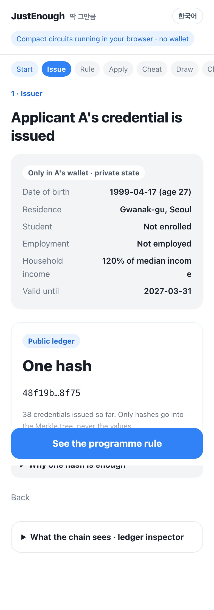
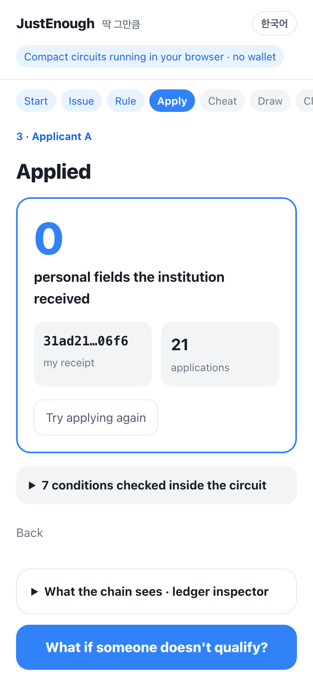
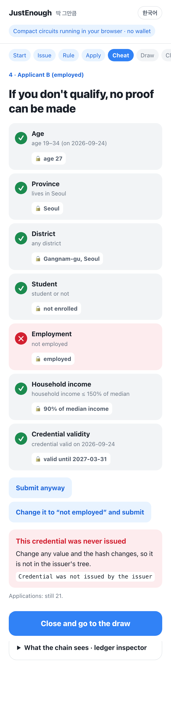
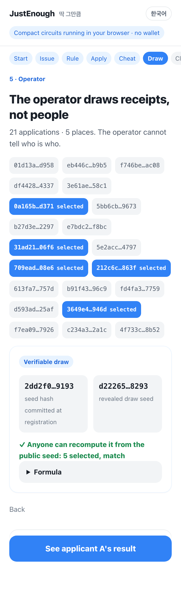

# JustEnough (딱 그만큼)

> **Prove you qualify, not who you are: apply to a grant or public programme with one zero-knowledge proof on Midnight. No documents, no personal values on-chain, one claim per person.**

[](https://github.com/Ryugi62/justenough/actions/workflows/ci.yml)
[](https://github.com/Ryugi62/justenough/actions/workflows/devnet.yml)
[](https://github.com/Ryugi62/justenough/actions/workflows/pages.yml)


**▶ Live demo, no wallet:** [English](https://ryugi62.github.io/justenough/?lang=en) · [한국어](https://ryugi62.github.io/justenough/?lang=ko) · [Web3 community grant scenario](https://ryugi62.github.io/justenough/?lang=en&preset=grant) — the compiled Compact circuits run in your browser.

```bash
git clone https://github.com/Ryugi62/justenough && cd justenough
npm ci && npm test                 # 112 tests on the committed compiled contract (no compiler needed)
npm run build && npm run preview   # the same wallet-free demo at the printed URL
```

**112 tests** · 1 Compact contract, 6 circuits (compactc 0.31.1, also compiled on 0.34.0) · full lifecycle run on a local Midnight network with real proofs (8 transactions) · Apache-2.0

Hackathon entries: Midnight Korea Hackathon 2026, 3rd-Web-Hack. Written from scratch during both events (first commit 2026-09-24); for 3rd-Web-Hack we added the English interface and the Web3 community grant scenario.

> **등본 대신, 자격만 증명해요.** 청년 지원금·장학금·공모에 신청할 때 주민등록등본·재학증명서·소득 서류를 내는 대신, “이 공고의 자격 조건을 충족한다”는 사실만 Midnight 위에서 영지식 증명으로 제출합니다. 기관은 서류도, 개인 값도 받지 않고 익명 영수증만 받아 추첨합니다. 선정되지 않은 사람의 개인정보는 애초에 기관에 없습니다.

- **Decks:** Midnight Korea Hackathon (Korean, 14 slides) [`docs/deck/JustEnough-deck.pdf`](docs/deck/JustEnough-deck.pdf) · 3rd-Web-Hack (English, 7 slides) [`docs/3rd-web-hack-deck.pdf`](docs/3rd-web-hack-deck.pdf)
- **Videos** (TTS narration, burned-in captions): Korean with English captions [`docs/video/JustEnough-demo.mp4`](docs/video/JustEnough-demo.mp4) · English [`docs/video/JustEnough-demo-en.mp4`](docs/video/JustEnough-demo-en.mp4)
- **Real network:** the full lifecycle ran on a local Midnight network with real proofs — 8 transactions, 0 attribute values in the indexer's public state ([`docs/devnet-run.json`](docs/devnet-run.json), re-run by CI)

| 1. Issue | 3. Apply | 4. Cheating is refused | 5. Anonymous draw |
|---|---|---|---|
|  |  |  |  |

## Project name

JustEnough (딱 그만큼)

## One-line description

Apply for a public youth programme by proving in zero knowledge that you meet its eligibility rule (age band, residence, employment, income) — the institution receives no document and no personal value, only an anonymous receipt it can draw by lottery.

## Why

A Korean youth allowance typically asks for a resident-registration copy (주민등록등본), an enrolment certificate and income papers. One copy of 등본 carries the full address and household members; the institution needs only three yes/no answers. The Personal Information Protection Act already asks for the minimum necessary data (arts. 3 and 16), and most applicants are not selected, yet their documents are collected, checked by hand and stored anyway.

JustEnough keeps the eligibility check and removes the documents:

- the **issuer** (the authority that already holds the records) publishes only a salted hash of each credential;
- the **operator** publishes the programme's rule, which is public text in the notice anyway;
- the **applicant** proves "a credential issued to me satisfies this rule" and files an anonymous receipt;
- the **operator** draws receipts by lottery; only the selected applicants ever step forward, off-chain, to be paid.

## How Midnight is used


- **Dual ledger, split on purpose.** Public ledger: the issuer key, a `HistoricMerkleTree<16, Bytes<32>>` of salted credential commitments, each programme's eligibility policy (public, like the notice it comes from), anonymous receipts and counters. Private state on the applicant's device: a 32-byte secret, the credential (birth date, province, district, student, employed, income %, valid-until) and its salt, fed to circuits through witnesses.
- **`apply` circuit.** Recomputes the credential commitment from private inputs, checks that the Merkle path leaf equals it, proves membership against a historic root (`merkleTreePathRoot` + `checkRoot`), evaluates the policy (`meetsPolicy`), and discloses only a receipt `persistentHash(domain, programId, secret)` — one application per person per programme, unlinkable across programmes.
- **Anonymous, auditable draw.** `registerProgram` commits to a draw seed derived in-circuit from the operator's secret and the programme id — before any receipt exists; `closeProgram` reveals it and the contract checks it against the commitment. The winners must be the `capacity` lowest `drawTicket(seed, receipt)` values, which anyone can recompute from the public ledger. Only a selected holder can prove a receipt is theirs (`claimBenefit`); the operator never learns who is behind a receipt.
- **Keys without `ownPublicKey()`.** Issuer, operator and holder keys are domain-separated `persistentHash` values of one witness secret, so one fee-paying wallet can act for any role and roles are proven, not claimed.
- **Checked, not claimed.** A test decodes every atom of the public transcript and ledger state after an application and asserts that no attribute value appears; a differential test checks the TypeScript rule against the compiled `meetsPolicy` circuit on 2,000 random cases; the full lifecycle also ran on a local Midnight network with real proofs from the proof server (8 transactions, `docs/devnet-run.json`), and a CI workflow repeats it on every push.

## What is public, what stays private

| Data | Where it lives | Who can read it |
|---|---|---|
| Birth date, province, district, student, employed, income %, valid-until | applicant's private state (witness `heldCredential`) | the applicant only |
| Salt, 32-byte secret | applicant's private state (`credentialSalt`, `localSecret`) | the applicant only |
| Credential commitment `hash(credential, holderKey, salt)` | public `credentials` Merkle tree | everyone — reveals nothing without the salt |
| Which leaf the applicant used | nowhere (membership proof) | nobody |
| Programme policy (age band, region, flags, income cap, reference date) | public `programs` map | everyone — it is the notice text |
| Receipt `hash(domain, programId, secret)` and its status | public `applications` map | everyone — unlinkable to the person and across programmes |
| Number of applicants / selected | public counters | everyone |
| Draw seed | commitment at registration, the seed itself once the programme closes | everyone — fixed before any receipt existed |

## How to run


```bash
# Node >= 22 and the Compact devtools (https://docs.midnight.network) are required
compact update 0.31.1                  # the compiler version the Midnight network supports
git clone https://github.com/Ryugi62/justenough && cd justenough
npm ci
npm run verify    # compile the contract (6 circuits) -> typecheck -> 112 tests -> build the web demo
npm run preview   # open the printed URL (add ?lang=en for English); the compiled circuits run in your browser, no wallet needed

# Optional, real network with real proofs (needs Docker): local node + indexer + proof server
npm run devnet:up && npm run devnet:e2e   # deploy -> issue -> register -> apply -> close -> select -> claim
```

Demo flow (7 screens): issue a credential → read the programme's public policy → apply with one proof → watch two cheating attempts get refused by the circuit → the operator reveals the draw seed it committed before anyone applied and selects 5 of 21 anonymous receipts, which the page re-checks → the selected applicant claims. The "What the chain sees" panel names every call, lists what it disclosed and re-scans the public ledger and that call's transcript for the applicant's private values (0 found at every step); the other tab shows what stays on the applicant's device. `?preset=grant` runs the same flow as a Web3 community grant (age 19–34, lives in Seoul, enrolled student, one grant per person); `?lang=en` or `?lang=ko` picks the language. The last screen shows the same flow's real-network run.

## Development

Other commands: `npm test` (tests only, uses the committed generated contract), `npm run compile:fast` (skip proving keys), `npm run e2e` (headless browser walk-through with screenshots; needs `npx playwright install chromium`).

## Contract — `contract/src/justenough.compact`

| Circuit | Caller | Proves / enforces | Discloses |
|---|---|---|---|
| `constructor` | deployer | — | `issuer = issuerKey(secret)` |
| `issueCredential(commitment)` | issuer | caller knows the issuer secret | the commitment (a hash) |
| `registerProgram(id, policy, capacity)` | operator | id unused, non-empty age band, capacity > 0 | id, policy, `operatorKey(secret)`, `seedCommitmentOf(drawSeedFor(secret, id))` |
| `apply(id)` | applicant | commitment ∈ tree (historic root), leaf = own commitment, `meetsPolicy`, first application, programme open | receipt (nullifier) |
| `closeProgram(id)` | operator | caller is this programme's operator; revealed seed matches the registration commitment | status, draw seed |
| `selectApplicant(id, receipt)` | operator | operator, programme closed, receipt submitted, under capacity | receipt status |
| `claimBenefit(id)` | applicant | own receipt is selected | receipt status |

Pure helpers exported for off-chain code (so TypeScript hashes exactly like the circuit): `issuerKey`, `operatorKey`, `holderKey`, `nullifierFor`, `credentialCommitment`, `meetsPolicy`, `drawSeedFor`, `seedCommitmentOf`, `drawTicket`.

**Draw audit.** After `closeProgram`, anyone can run `auditDraw` (`src/application/use-cases.ts`) against the public ledger: it recomputes `drawTicket(seed, receipt)` for every receipt and checks that the selected receipts are exactly the `capacity` lowest tickets. The demo shows the result on the draw screen; a test shows the audit catching an operator who picked someone else.

Age is 만 나이: `birthRangeFor(referenceDate, {minAge, maxAge})` turns "만 19~34세" into an inclusive YYYYMMDD range, so the circuit only compares integers (swept against the definition for every day of 2027–2028, including 29 February).

## Architecture

```
contract/src/justenough.compact ──compactc──▶ contract/src/managed/justenough (generated)
                                                        ▲
src/domain        dates · regions · eligibility · notices · presets · draw   (no SDK, no I/O)
   ▲
src/application   ports · use cases (register, apply, draw, claim)      (domain only)
   ▲
src/adapters      simulator: compiled contract + compact-runtime, implements the ports; chain view + leak scan
scripts/devnet-*  real network: midnight-js providers + proof server, same contract and witnesses
   ▲
web/              composition root + UI (Vite, no framework, system fonts only; ko/en catalogues in web/i18n.ts)
```

`tests/architecture.test.ts` fails if the domain imports anything outside itself or if domain/application touch `@midnight-ntwrk/*` or the generated contract.

## Tests (112)

| Suite | What it pins down |
|---|---|
| `tests/contract/justenough.contract.test.ts` (27) | issuer-only issuance · eligible apply · **no attribute value in public state or transcript** · duplicate refused · unissued / tampered credential refused · borrowed Merkle path refused · each predicate enforced · receipts unlinkable · historic roots · closed programmes · operator-only close/select · capacity · claim only when selected · draw seed committed at registration and revealed at close |
| `tests/contract/differential.test.ts` (1) | TypeScript rule ≡ compiled `meetsPolicy` on 2,000 boundary-heavy random cases |
| `tests/application/*.test.ts` (11) | use cases with fakes; draw selects the lowest tickets; the audit catches a manipulated selection; full lifecycle on the compiled contract; every real clause registers |
| `tests/domain/*.test.ts` (41) | 만 나이 edges (incl. 29 Feb), eligibility explanations in Korean and English, clause → policy, English glosses for every clause, both demo presets (A eligible, B fails exactly one predicate, the forged credential passes the values), ticket ranking and audit |
| `tests/adapters/*.test.ts` (8) | the privacy scanner itself (little-endian atom decoding, no false positive from a hash that merely contains the digits); "What the chain sees": 0 private values after every call, a positive control that finds the public income cap, and the Web3 grant preset's accept / duplicate / ineligible / forged beats on the compiled contract |
| `tests/web/i18n.test.ts` (4) | Korean and English catalogues have the same keys; no Hangul in English outside `lang="ko"`; language choice from `?lang=` and the browser |
| `tests/architecture.test.ts` (3) | Clean Architecture dependency rule |
| `tests/docs/*.test.ts` (17) | this README ≡ the submission form text; README first screen (tagline, demo links, 3-line quick start, test count, CI badge, both hackathon entries); both decks present; the recorded devnet run (8 transactions, 2 refusals, seed commitment matched, 0 attribute values among the decoded public atoms) |

`node scripts/check-test-count.mjs` (run in CI) fails if any count stated here differs from what vitest actually ran. `node scripts/demo-flow.mjs` walks the demo headless in Korean and English, both presets, at 390 px and 1280 px, and fails on horizontal overflow, a page error, or any Hangul outside `lang="ko"` in the English runs.

## Real notice clauses → policies

`src/domain/notices.ts` holds eligibility sentences quoted verbatim from Korean notices (retrieved September 2026) and the policy each becomes. What a policy cannot express is listed, not dropped.

| Notice | Clause (verbatim) | Policy | Outside the circuit |
|---|---|---|---|
| 2026 국방 AI 경진대회 | 일반인 (대한민국 국적의 청년, 만 19~34세) | age 19–34 | nationality → issuer scope |
| 2026 청년 오픈이노베이션 챌린지 | 전국 소재의 만 34세 이하 대학(원)생 및 청년 예비창업자(팀) | age ≤ 34 ∧ student | founder path (OR) → second programme |
| 2026 인천관광 혁신아이디어 공모전 | 인천시민 및 인천 소재 학교 재학생·회사 임직원 | province = 28 | school / workplace path |
| 서초창업스테이션 컨설팅 | (예비)창업자 * 서초구 거주자, 서초구 소재 기업 우대 | district = 11650 (preference track) | founder status, company path |
| Web3 블록체인 AI융합 해커톤 | 국내 대학 학부 재·휴학생 2~4인 팀 | student | undergraduate / leave, team size |
| AI기반 통일 아이디어 공모전 | 국내 대학(원)생(충청남도/충청북도/세종특별자치시/대전광역시 소재) | student | school in one of 4 provinces (set membership) |
| 그린리모델링 콘텐츠 공모전 | [42초 AI 영화제]만 19세 이상 일반 국민 | age ≥ 19 | nationality, team size |

The flagship demo programme (`DEMO_PROGRAM`, "청년 구직 활동 지원금") is **synthetic** and labelled as such in the UI: age 19–34 ∧ Seoul ∧ not employed ∧ income ≤ 150 % of median.

## Threat model and limits

See [`docs/THREAT-MODEL.md`](docs/THREAT-MODEL.md). In short: the issuer is trusted to attest correctly and to issue one credential per person; commitments are salted so small attribute spaces cannot be brute-forced; receipts are unlinkable across programmes; the draw is auditable, but an operator who leaks its committed seed early could help a colluding applicant pick a lucky secret before issuance (mitigation: a public randomness beacon); the timing of an application and the anonymity-set size (credentials issued before the root used) are visible. The browser demo executes the compiled circuits with `@midnight-ntwrk/compact-runtime` against an in-page ledger; on a Midnight network the same circuits are proven by the proof server — `npm run devnet:e2e` shows it.

**Why one issuer.** Residence, employment and income records sit with different authorities, but public institutions can already fetch them, with the applicant's consent, through one government data-sharing channel (행정정보 공동이용 / 공공 마이데이터). That channel is the natural issuer: it would publish hashes instead of handing each institution the full record. Multi-issuer proofs are on the roadmap.

## Roadmap

1. **Preprod deployment** — the script is ready (`MIDNIGHT_NETWORK=preprod npm run devnet:e2e`); it needs a faucet-funded wallet.
2. Wallet-connected UI mode (Lace, `midnight-js` adapter behind the same application ports). The zero-install browser demo stays the default so reviewers can verify without a wallet.
3. Issuer adapter for the government data-sharing channel; multi-issuer proofs.
4. Set-membership and OR policies; revocation via issuer epoch roots; a public randomness beacon mixed into the draw seed; operator-namespaced programme ids.

## Ecosystem attribution

Built with [Compact](https://docs.midnight.network) (compactc 0.31.1, also compiled on 0.34.0) and `@midnight-ntwrk/compact-runtime` 0.16.0. Design references: Midnight documentation, the `midnight-expert` Claude Code plugin knowledge base (anonymous membership and nullifier patterns) and the `midnight-awesome-dapps` list. The devnet compose file uses the same images as `midnightntwrk/example-hello-world`, and `scripts/devnet-wallet.ts` follows that example's wallet-provider pattern (Apache-2.0). No contract or application code was copied. Repository topic: `midnightntwrk`.

## License

Apache-2.0 — see [LICENSE](LICENSE).
